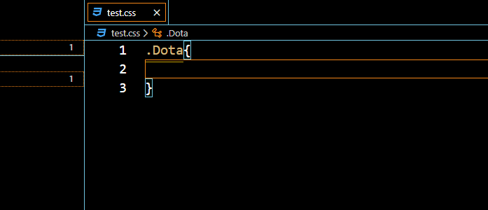

# dota2-plugins

A simple "vscode" plugins for dota2.

## Features

* Erase errors and add hints for dota2 engine defined css properties in pattern `*.css` files.[Dota2 Css Wiki](https://developer.valvesoftware.com/wiki/Dota_2_Workshop_Tools/Panorama/CSS_Properties)

## Author

* `invoker` [home](https://github.com/invokerrrr) [email](mailto:594404963@qq.com)

## License

MIT
